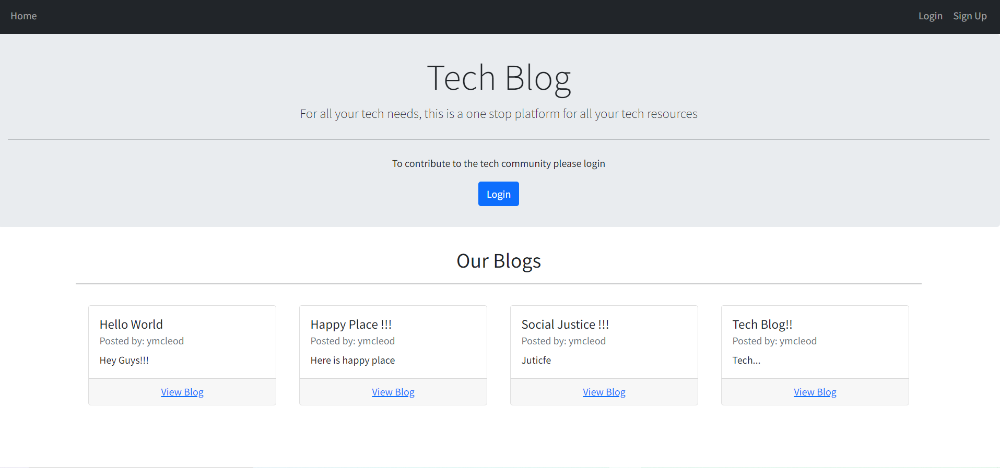
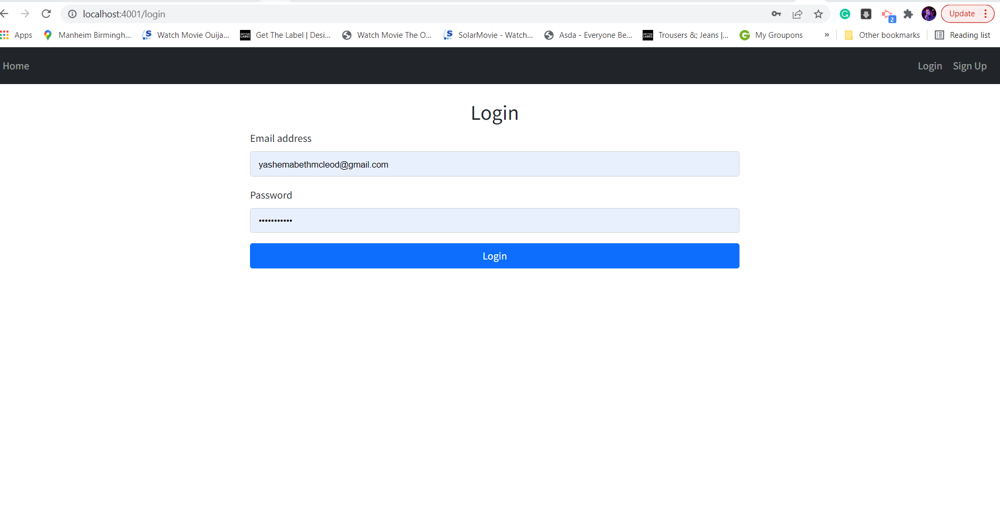
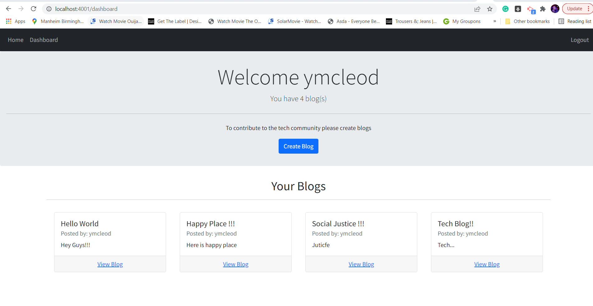
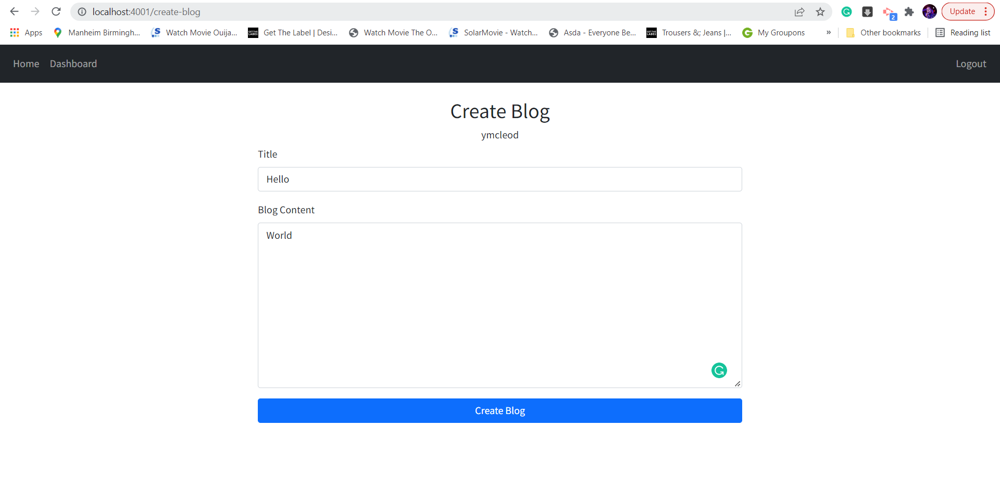
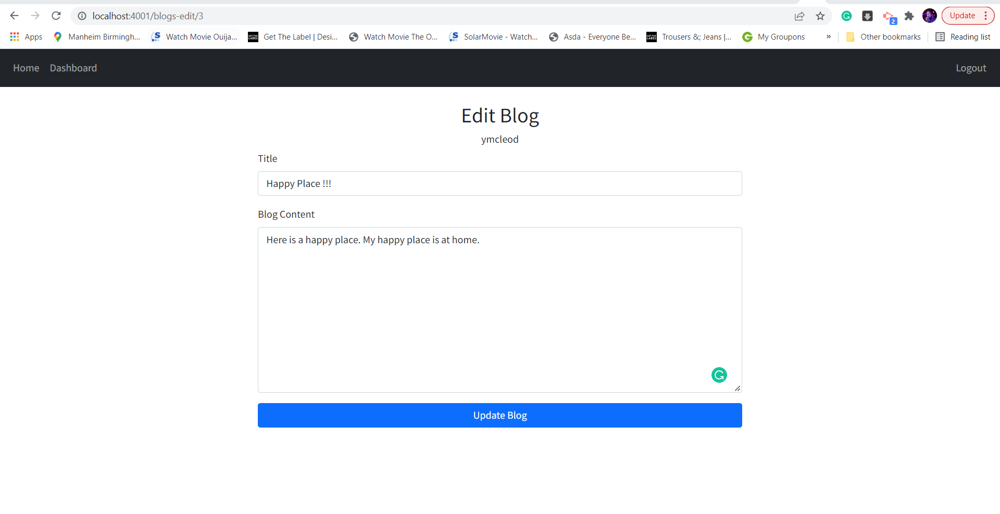
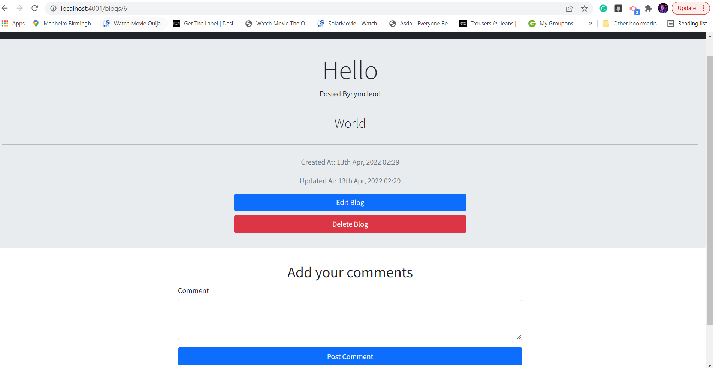

# Tech-blog

## Description

## Github URL

- https://github.com/Yashemabeth/tech-blog

## Heroku URL

-

## User Story

-AS A developer who writes about tech
I WANT a CMS-style blog site
SO THAT I can publish articles, blog posts, and my thoughts and opinions

## Installation

- Open the terminal in VS Code and type npm run dev

## Technologies Used

- node

## Screenshots

Homepage

Login Page

User Dashboard

Create Blog

Edit Blog

Delete Blog

